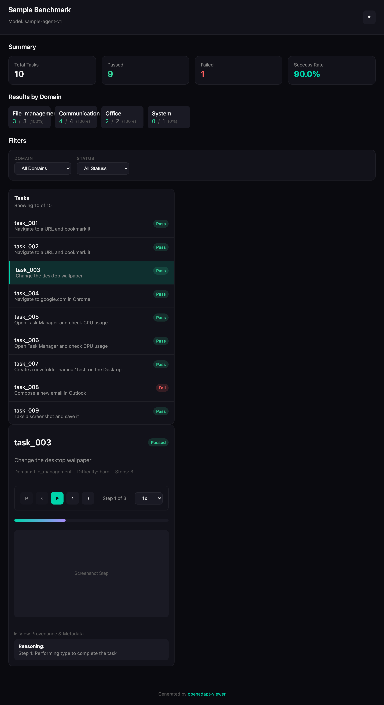

# openadapt-viewer

[](https://github.com/OpenAdaptAI/openadapt-viewer/actions/workflows/test.yml)
[](https://pypi.org/project/openadapt-viewer/)
[](https://pypi.org/project/openadapt-viewer/)
[](LICENSE)

An eval finished overnight and left you a directory of JSON, a SQLite file, and
a folder of screenshots. This turns that into one HTML file you can open,
scroll, and mail to a colleague: metric cards, a filterable task list, click
markers drawn over the screenshots, and playback controls for stepping through
a recording frame by frame.

It's for people building on OpenAdapt who want to look at a run without
standing up a server. It renders once and writes a file. If you want a
dashboard that refreshes while a job is still running, look elsewhere.

[PyPI](https://pypi.org/project/openadapt-viewer/) ·
[Component reference](docs/COMPONENTS.md) ·
[openadapt-capture](https://github.com/OpenAdaptAI/openadapt-capture), which
records what this plays back

## Sixty seconds

```bash
pip install openadapt-viewer
openadapt-viewer demo --tasks 10 --output viewer.html
```

```
Generating demo viewer with 10 sample tasks...
Generated: viewer.html
```

Open `viewer.html` in a browser and you get this:



Real output, macOS, 2026-08-28, with `task_003` clicked. The demo's pass and
fail values come from an unseeded `random.random()`, so your success rate
will probably differ and your tasks won't be these tasks. Rerun the picture with
`python scripts/generate_demo_screenshot.py`.

## Build a page out of parts

Each component is a function that returns HTML text. Call `badge("Pass",
color="success")` and you get this back, nothing more:

```html
<span class="oa-badge oa-badge-success" style="padding: 4px 10px; font-size: 0.75rem;">
    Pass
</span>
```

Paste that into a template you already own, or hand the pieces to
`PageBuilder` and let it write the whole document:

```python
from openadapt_viewer.builders import PageBuilder
from openadapt_viewer.components import badge, metrics_grid

page = PageBuilder(title="Nightly eval", dark_mode=True)
page.add_header(title="Nightly eval", subtitle="run 2026-08-28")
page.add_section(
    metrics_grid([
        {"label": "Tasks", "value": 42},
        {"label": "Passed", "value": 39, "color": "success"},
        {"label": "Failed", "value": 3, "color": "error"},
    ]),
    title="Summary",
)
page.add_section(badge("Pass", color="success"))
print(page.render_to_file("eval.html"))
```

```
eval.html
```

15 KB with the stylesheet inlined. The page renders dark and the sun button in
the header switches it; the `dark_mode` argument is ignored. There
are 22 components: screenshot overlays, action timelines, filter bars,
side-by-side comparison views, failure-analysis panels, and the small stuff
like badges and metric cards. [docs/COMPONENTS.md](docs/COMPONENTS.md) has
every signature.

## Play back a capture

```python
from openadapt_viewer.viewers.capture.generator import generate_capture_html

steps = [
    {"timestamp": 0.0, "duration": 1.2, "action": {"type": "click", "x": 0.42, "y": 0.31}},
    {"timestamp": 1.2, "duration": 2.4, "action": {"type": "type", "text": "Jane Doe"}},
    {"timestamp": 3.6, "duration": 0.9, "action": {"type": "click", "x": 0.78, "y": 0.64}},
]

print(generate_capture_html(
    capture_id="turn-off-nightshift",
    goal="Turn off Night Shift in Display settings",
    steps=steps,
    output_path="capture_viewer.html",
))
```

```
capture_viewer.html
```

Give a step a `"screenshot"` key holding a path or a data URI and the player
shows the frame with a marker on it. Click coordinates are fractions of the
frame, not pixels, so `0.42` means 42% across.

A whole recording written by openadapt-capture goes through the benchmark
viewer instead. Point it at the directory, which needs `episodes.json` and a
`recording.db` inside it:

```bash
openadapt-viewer benchmark --data turn-off-nightshift --output viewer.html
```

```
Generating benchmark viewer from: turn-off-nightshift
Generated: viewer.html
```

Set `$OPENADAPT_CAPTURE_RECORDING` to that directory and you can drop `--data`.
There's also `openadapt-viewer catalog scan --capture-dir DIR`, which indexes
recordings into `~/.openadapt/catalog.db` so the segmentation viewer can find
them; `catalog stats` prints the counts.

## What it doesn't do

The generated page loads Alpine.js from `cdn.jsdelivr.net`, so it isn't
offline-safe. Block that request and the summary cards and the filter dropdowns
still paint, because their markup sits in the file, but the task list comes up
empty and clicking does nothing. `benchmark --standalone` does not help: the
flag reaches the generator and the generator ignores it.

Five more things to know before you file a bug:

- The benchmark viewer writes a real recording's screenshots into the page as
  absolute local paths, so a viewer built from a recording loses its images the
  moment you move or mail the file. Only `demo` inlines them.

- The capture viewer writes `<link href="src/openadapt_viewer/styles/episode_timeline.css">`
  into the page, resolved against wherever the HTML ends up. That file and its
  companion `episode_timeline.js` ship inside the installed package, so unless
  your output happens to land at the root of a source checkout, the episode
  timeline renders unstyled and inert.
- `screenshot_display` links images by path. It inlines them as base64 only
  when you pass `embed_image=True`. Move the HTML away from the PNGs without
  that flag and the images break.
- Give `benchmark --data` a directory holding a pre-2026-07-17 `capture.db`
  and it neither reads it nor says so. `LegacyCaptureError` subclasses
  `FileNotFoundError`, the generator's fallback catches it, and you get a
  viewer with zero tasks and a success message. The migration script named in
  that error never reaches you.
- `openadapt_viewer.__version__` reads `0.1.0`, which is not the packaged
  version. Read the version from package metadata instead.

## Development

```bash
git clone https://github.com/OpenAdaptAI/openadapt-viewer && cd openadapt-viewer
uv sync --all-extras
uv run ruff check .
uv run pytest tests/ -v
```

Two test modules read recordings that openadapt-capture actually wrote, rather
than fixtures written to match this repo's idea of the schema. Clone it
alongside and point them at it:

```bash
export OPENADAPT_CAPTURE_DIR=/path/to/openadapt-capture
export OPENADAPT_CAPTURE_EXAMPLES=$OPENADAPT_CAPTURE_DIR/examples/captures
```

CI runs Python 3.10 and 3.11 on Ubuntu and macOS. `ruff check .` is a blocking
gate over the whole repository, so lint before you push.

## License

MIT. See [LICENSE](LICENSE).
