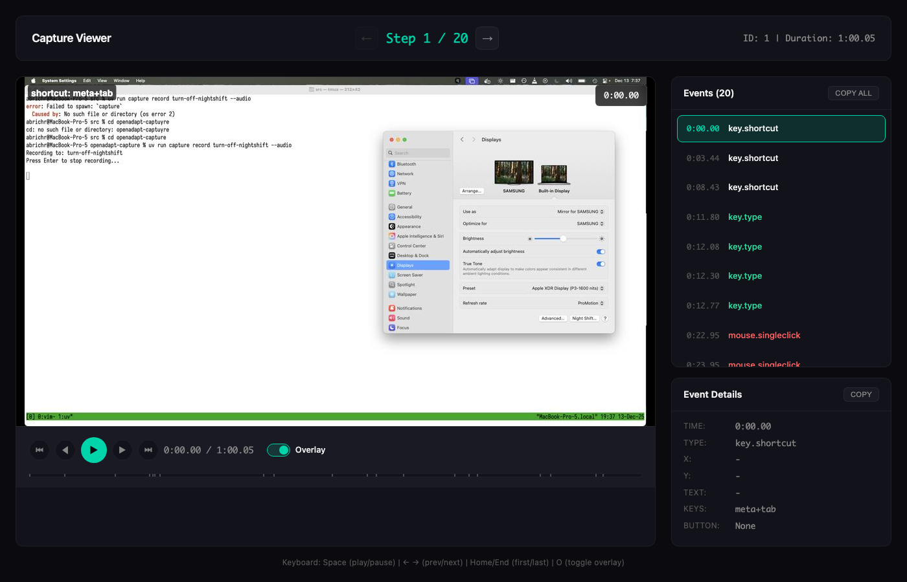
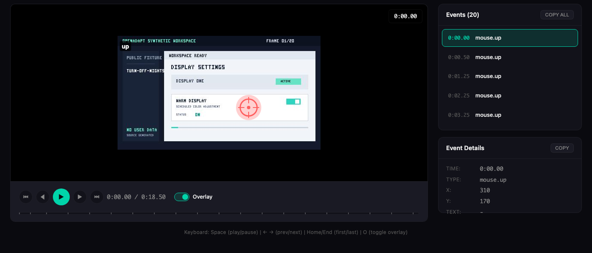
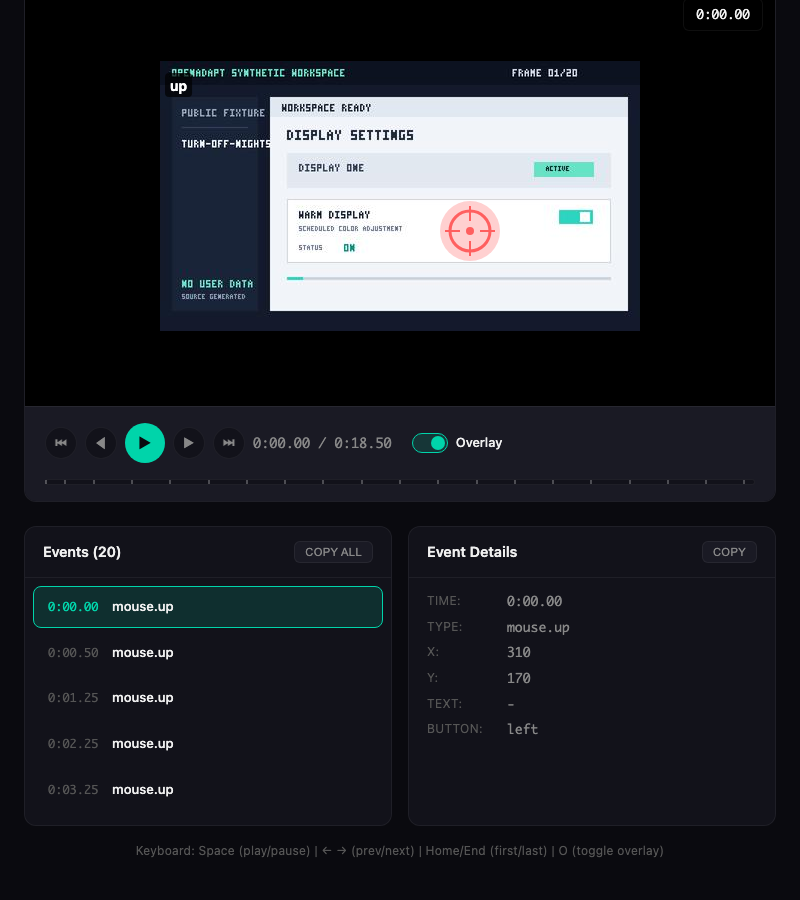
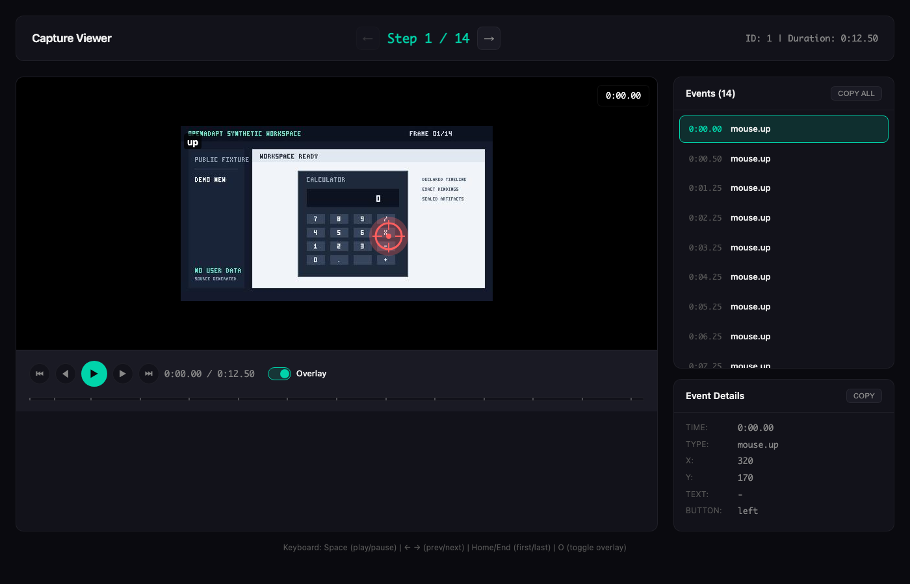

# openadapt-viewer

[](https://github.com/OpenAdaptAI/openadapt-viewer/actions/workflows/publish.yml)
[](https://pypi.org/project/openadapt-viewer/)
[](https://opensource.org/licenses/MIT)
[](https://www.python.org/downloads/)

Reusable component library for OpenAdapt visualization. Build standalone HTML viewers for training dashboards, benchmark results, capture playback, and demo retrieval.

## Features

- **Component-based**: Reusable building blocks (screenshot, playback, metrics, filters)
- **Composable**: Combine components to build custom viewers
- **Standalone HTML**: Generated files work offline, no server required
- **Event transcript**: Real-time audio transcription synchronized with playback
- **Consistent styling**: Shared CSS variables and dark mode support
- **Alpine.js integration**: Lightweight interactivity out of the box

## Installation

```bash
pip install openadapt-viewer
```

Or with uv:
```bash
uv add openadapt-viewer
```

## Quick Start

### Using Components

```python
from openadapt_viewer.components import (
    screenshot_display,
    playback_controls,
    metrics_grid,
    filter_bar,
    badge,
)

# Screenshot with click overlays
html = screenshot_display(
    image_path="screenshot.png",
    overlays=[
        {"type": "click", "x": 0.5, "y": 0.3, "label": "H", "variant": "human"},
        {"type": "click", "x": 0.6, "y": 0.4, "label": "AI", "variant": "predicted"},
    ],
)

# Metrics cards
html = metrics_grid([
    {"label": "Total Tasks", "value": 100},
    {"label": "Passed", "value": 75, "color": "success"},
    {"label": "Failed", "value": 25, "color": "error"},
    {"label": "Success Rate", "value": "75%", "color": "accent"},
])
```

### Using PageBuilder

Build complete pages from components:

```python
from openadapt_viewer.builders import PageBuilder
from openadapt_viewer.components import metrics_grid, screenshot_display

builder = PageBuilder(title="My Viewer", include_alpine=True)

builder.add_header(
    title="Benchmark Results",
    subtitle="Model: gpt-5.1",
    nav_tabs=[
        {"href": "dashboard.html", "label": "Training"},
        {"href": "viewer.html", "label": "Viewer", "active": True},
    ],
)

builder.add_section(
    metrics_grid([
        {"label": "Tasks", "value": 100},
        {"label": "Passed", "value": 75, "color": "success"},
    ]),
    title="Summary",
)

# Render to file
builder.render_to_file("output.html")
```

### Ready-to-Use Viewers

5 production viewers available:

1. **Benchmark Viewer** - Visualize benchmark evaluation results
2. **Capture Viewer** - Playback recorded GUI interactions
3. **Training Dashboard** - Monitor ML training progress (via openadapt-ml)
4. **Retrieval Viewer** - Display demo search results (via openadapt-retrieval)
5. **Segmentation Viewer** - View episode segmentation results

```python
from openadapt_viewer.viewers.benchmark import generate_benchmark_html

# From benchmark results directory
generate_benchmark_html(
    data_path="benchmark_results/run_001/",
    output_path="viewer.html",
)
```

All viewers use the canonical component-based pattern. See `VIEWER_PATTERNS.md` for details.

## CLI Usage

```bash
# Generate demo benchmark viewer
openadapt-viewer demo --tasks 10 --output viewer.html

# Generate from benchmark results
openadapt-viewer benchmark --data results/run_001/ --output viewer.html

# Generate screenshots for README embedding
openadapt-viewer screenshots readme --auto-detect --save-index

# Generate screenshots for specific viewer type
openadapt-viewer screenshots readme --viewer-type benchmark --viewport desktop

# Generate screenshots from specific HTML file
openadapt-viewer screenshots readme --html-file viewer.html --output-dir screenshots/
```

## Components

All components return HTML strings that can be composed together. Use them with PageBuilder or embed inline.

### Core Components

| Component | Description | Example Use Case |
|-----------|-------------|-----------------|
| `screenshot_display` | Screenshot with click/highlight overlays | Capture frames, demo screenshots |
| `playback_controls` | Play/pause/speed controls for step playback | Video-like playback |
| `timeline` | Progress bar for step navigation | Scrub through recordings |
| `action_display` | Format actions (click, type, scroll, etc.) | Display action details |
| `metrics_card` | Single statistic card | Individual metric display |
| `metrics_grid` | Grid of metric cards | Summary dashboards |
| `filter_bar` | Filter dropdowns with optional search | Filter and search data |
| `filter_dropdown` | Single dropdown filter | Domain/status filters |
| `selectable_list` | List with selection support | Task lists, file lists |
| `list_item` | Individual list item | Custom list entries |
| `badge` | Status badges (pass/fail, etc.) | Status indicators |

### Enhanced Components

| Component | Description | Example Use Case |
|-----------|-------------|-----------------|
| `video_playback` | Video playback from screenshot sequences | Smooth capture playback |
| `video_playback_with_actions` | Video + synchronized action overlay | Capture with action overlay |
| `action_timeline` | Timeline with action markers | Action sequence view |
| `action_timeline_vertical` | Vertical action timeline | Compact action view |
| `comparison_view` | Side-by-side comparison | Before/after, A/B test |
| `overlay_comparison` | Overlay comparison with slider | Image comparison |
| `action_type_filter` | Filter by action type | Filter clicks/types/scrolls |
| `action_type_pills` | Action type pill buttons | Quick action filtering |
| `action_type_dropdown` | Action type dropdown | Compact action filter |
| `failure_analysis_panel` | Failure analysis dashboard | Benchmark failure analysis |
| `failure_summary_card` | Failure summary card | Individual failure details |

**Total: 22 components** available for building viewers.

See `VIEWER_PATTERNS.md` for complete usage examples.

## Project Structure

```
src/openadapt_viewer/
├── components/           # Reusable UI building blocks
│   ├── screenshot.py     # Screenshot with overlays
│   ├── playback.py       # Playback controls
│   ├── timeline.py       # Progress bar
│   ├── action_display.py # Action formatting
│   ├── metrics.py        # Stats cards
│   ├── filters.py        # Filter dropdowns
│   ├── list_view.py      # Selectable lists
│   └── badge.py          # Status badges
├── builders/             # High-level page builders
│   └── page_builder.py   # PageBuilder class
├── styles/               # Shared CSS
│   └── core.css          # CSS variables and base styles
├── core/                 # Core utilities
│   ├── types.py          # Pydantic models
│   └── html_builder.py   # Jinja2 utilities
├── viewers/              # Full viewer implementations
│   └── benchmark/        # Benchmark results viewer
├── examples/             # Reference implementations
│   ├── benchmark_example.py
│   ├── training_example.py
│   ├── capture_example.py
│   └── retrieval_example.py
└── templates/            # Jinja2 templates
```

## Automated Screenshot & Animation Generation

The viewer includes comprehensive screenshot and animation generation systems for creating visual demos that can be embedded in README files and documentation.

### Static Screenshots

Generate static PNG screenshots at multiple viewports for documentation.

### Features

- **Multi-Viewer Support**: Automatically generates screenshots for benchmark, training, capture, and segmentation viewers
- **Multiple Viewports**: Desktop (1920x1080), tablet (1024x768), and mobile (375x667) viewports
- **Auto-Detection**: Finds viewer HTML files in standard locations across openadapt projects
- **Index Generation**: Creates a JSON catalog of all generated screenshots with metadata
- **Flexible Filtering**: Generate screenshots for specific viewer types or viewports only

### Installation

Screenshot generation requires Playwright:

```bash
# Install Playwright
uv add playwright

# Install browser (one-time setup)
uv run playwright install chromium
```

### Usage

```bash
# Auto-detect and generate screenshots for all viewer types
uv run openadapt-viewer screenshots readme --auto-detect --save-index

# Generate for specific viewer type only
uv run openadapt-viewer screenshots readme --viewer-type benchmark --auto-detect

# Generate for specific viewport only (faster)
uv run openadapt-viewer screenshots readme --viewport desktop --auto-detect

# Generate from specific HTML file
uv run openadapt-viewer screenshots readme --html-file benchmark_viewer.html

# Custom output directory
uv run openadapt-viewer screenshots readme --auto-detect --output-dir docs/images/
```

### What Gets Generated

For each viewer type, the system generates:

1. **Overview screenshot**: Full viewer interface at initial state
2. **Details screenshot**: Viewer with expanded details/interaction
3. **Full page screenshot**: Complete page scroll capture

Example output structure:

```
screenshots/
├── benchmark_desktop_overview.png
├── benchmark_desktop_details.png
├── benchmark_desktop_full_page.png
├── training_desktop_dashboard.png
├── training_desktop_charts.png
├── capture_desktop_player.png
├── segmentation_desktop_episodes.png
└── index.json  (metadata catalog)
```

### Using Screenshots in README

After generation, embed screenshots in your README:

```markdown
## Benchmark Viewer


Desktop view showing benchmark results with metrics grid and task list.

[View Interactive Demo](benchmark_viewer.html)

### Mobile View


Responsive layout optimized for mobile devices.
```

### Index/Catalog Format

The generated `index.json` provides metadata about all screenshots:

```json
{
  "generated_at": "2026-01-18T10:43:19.038403",
  "total_screenshots": 12,
  "output_dir": "screenshots/readme",
  "screenshots": {
    "benchmark": {
      "desktop": [
        {
          "filename": "benchmark_desktop_overview.png",
          "path": "screenshots/readme/benchmark_desktop_overview.png",
          "size_bytes": 98636,
          "size_kb": 96.32
        }
      ]
    }
  }
}
```

### Python API

You can also use the screenshot generator programmatically:

```python
from pathlib import Path
from openadapt_viewer.scripts.generate_readme_screenshots import ScreenshotGenerator

# Initialize generator
generator = ScreenshotGenerator(
    output_dir=Path("screenshots"),
    viewer_type="benchmark",  # or None for all types
    viewport="desktop",       # or None for all viewports
)

# Auto-detect HTML files
html_files = generator.auto_detect_html_files([
    Path("."),
    Path("../openadapt-evals"),
    Path("../openadapt-ml"),
])

# Generate screenshots
results = generator.generate_all_screenshots(html_files)

# Generate index/catalog
index = generator.generate_index()
```

### Animated Screenshots (GIF/MP4)

**NEW**: Generate animated GIF/MP4 demos showing UIs in action.

#### Quick Start

```bash
# Install dependencies
uv add playwright pillow imageio
uv run playwright install chromium
brew install gifsicle  # macOS (for optimization)

# Generate animation for segmentation viewer
uv run python scripts/generate_animations.py \
    --ui segmentation-viewer \
    --html segmentation_viewer.html \
    --output animations/

# With MP4 (higher quality alternative)
uv run python scripts/generate_animations.py \
    --ui benchmark-viewer \
    --html viewer.html \
    --output animations/ \
    --all-formats
```

#### Available UIs

- `segmentation-viewer` - Episode list, selection, search, key frames
- `benchmark-viewer` - Task list, details, execution replay, logs
- `training-dashboard` - Training progress, loss curves, evaluations
- `capture-viewer` - Playback controls, timeline, event details
- `synthetic-demo-viewer` - Domain filter, task selection, demo content

#### Features

- **Automated UI Interaction**: Playwright-based scenarios with clicks, typing, scrolling
- **Caption Overlays**: Automatic captions on each frame
- **GIF Optimization**: Automatic file size optimization (< 2 MB target)
- **Validation**: Built-in checks for quality and correctness
- **Multiple Formats**: GIF (primary) and MP4 (alternative)

#### Documentation

- [ANIMATION_QUICK_START.md](ANIMATION_QUICK_START.md) - Quick start guide
- [ANIMATION_INFRASTRUCTURE.md](ANIMATION_INFRASTRUCTURE.md) - Complete architecture
- [/Users/abrichr/oa/src/ANIMATION_INFRASTRUCTURE_SUMMARY.md](/Users/abrichr/oa/src/ANIMATION_INFRASTRUCTURE_SUMMARY.md) - Implementation summary

#### Example Output

```markdown
## Segmentation Viewer


**Features shown**:
- Episode list with thumbnails
- Episode details and key frames
- Real-time search filtering

[View full-resolution version](animations/segmentation-viewer.mp4) (MP4, 5MB)
```

## Audio Transcript Feature

The viewer includes a powerful **audio transcript** feature that displays real-time transcription of captured audio alongside the visual playback. This is particularly useful for:

- **Debugging workflows**: See what was said at each step
- **Documentation**: Auto-generate narrative descriptions of recorded sessions
- **Analysis**: Correlate verbal instructions with UI actions
- **Training**: Review narrated demonstrations with synchronized visuals

### Key Capabilities

The transcript panel provides:

- **Timestamped transcription**: Each transcript segment is stamped with its time in the recording (e.g., `0:00.00`, `0:05.60`)
- **Synchronized playback**: Transcript automatically highlights and scrolls as the video plays
- **Searchable text**: Find specific moments in long recordings by searching transcript content
- **Copy functionality**: Export transcript text for documentation or analysis

### How It Works

When captures are recorded with audio (using `openadapt-capture`'s audio recording features), the viewer automatically:

1. Displays the transcript in a dedicated panel in the sidebar
2. Timestamps each transcript segment relative to the recording start time
3. Syncs transcript highlighting with the current playback position
4. Updates the displayed transcript as you navigate through events

The transcript appears alongside the event list and event details, providing a complete picture of what happened during the recording.

## Synthetic Demo Viewer

**NEW:** Interactive browser-based viewer for synthetic WAA demonstration data.

### Quick Start

```bash
# Open the synthetic demo viewer
open synthetic_demo_viewer.html
```

### What It Shows

- **82 synthetic demos** across 6 domains (notepad, paint, clock, browser, file_explorer, office)
- **Filter by domain** and select specific tasks
- **View demo content** with syntax-highlighted steps
- **See how demos are used** in actual API prompts
- **Impact comparison**: 33% → 100% accuracy improvement with demo-conditioned prompting
- **Action reference**: All 8 action types (CLICK, TYPE, WAIT, etc.)

### Purpose

Synthetic demos are **AI-generated example trajectories** that show step-by-step how to complete Windows automation tasks. They are included in prompts when calling Claude/GPT APIs during benchmark evaluation - this is called **demo-conditioned prompting**.

**Impact:** Improved first-action accuracy from 33% to 100%!

### Documentation

- **Quick Start**: `QUICK_REFERENCE.md` - One-page overview
- **Complete Guide**: `SYNTHETIC_DEMOS_EXPLAINED.md` - Full explanation
- **Examples**: `DEMO_EXAMPLES_SHOWCASE.md` - 5 diverse demo examples
- **Master Index**: `SYNTHETIC_DEMO_INDEX.md` - Central navigation hub

### Features

- Beautiful dark theme matching OpenAdapt style
- Domain filtering (All, Notepad, Paint, Clock, Browser, File Explorer, Office)
- Task selector with estimated step counts
- Dual-panel display: demo content + prompt usage
- Side-by-side impact comparison (with vs without demos)
- Complete action types reference
- Fully self-contained (no external dependencies)
- Works offline

See `SYNTHETIC_DEMO_INDEX.md` for complete documentation.

---

## Screenshots

### Full Viewer Interface

The viewer provides a complete interface for exploring captured GUI interactions with playback controls, timeline navigation, event details, and **real-time audio transcript**.


*Interactive viewer showing the "Turn off Night Shift" workflow with screenshot display (center), event list (right sidebar top), and **audio transcript** (right sidebar bottom)*

### Playback Controls

Step through captures with playback controls, timeline scrubbing, and keyboard shortcuts (Space to play/pause, arrow keys to navigate).


*Timeline and playback controls with overlay toggle, plus event details and **synchronized transcript panel***

### Event List, Details, and Transcript

Browse all captured events with detailed information about each action. The **transcript panel** displays timestamped audio transcription that syncs with playback, showing exactly what was said at each moment in the recording.


*Event list sidebar showing captured actions with timing and type information, plus **live audio transcript with timestamps***

### Demo Workflow


*Example demo workflow viewer*

## Examples

Run the examples to see how different OpenAdapt packages can use the component library:

```bash
# Benchmark results (openadapt-evals)
python -m openadapt_viewer.examples.benchmark_example

# Training dashboard (openadapt-ml)
python -m openadapt_viewer.examples.training_example

# Capture playback (openadapt-capture)
python -m openadapt_viewer.examples.capture_example

# Retrieval results (openadapt-retrieval)
python -m openadapt_viewer.examples.retrieval_example
```

### Generating Screenshots

To regenerate the README screenshots:

```bash
# Install playwright (one-time setup)
uv pip install "openadapt-viewer[screenshots]"
uv run playwright install chromium

# Install openadapt-capture (required)
cd ../openadapt-capture
uv pip install -e .
cd ../openadapt-viewer

# Generate screenshots
uv run python scripts/generate_readme_screenshots.py

# Or with custom options
uv run python scripts/generate_readme_screenshots.py \
  --capture-dir /path/to/openadapt-capture \
  --output-dir docs/images \
  --max-events 50
```

The script will:
1. Load captures from `openadapt-capture` (turn-off-nightshift and demo_new)
2. Generate interactive HTML viewers
3. Take screenshots using Playwright
4. Save screenshots to `docs/images/`

## Development

```bash
# Clone and install
git clone https://github.com/OpenAdaptAI/openadapt-viewer.git
cd openadapt-viewer
uv sync --all-extras

# Run tests
uv run pytest tests/ -v

# Run linter
uv run ruff check .
```

## Integration

Used by other OpenAdapt packages:

- **openadapt-ml**: Training dashboards and model comparison
- **openadapt-evals**: Benchmark result visualization
- **openadapt-capture**: Capture recording playback
- **openadapt-retrieval**: Demo search result display

## Documentation

- **[VIEWER_PATTERNS.md](VIEWER_PATTERNS.md)** - Canonical pattern for building viewers (MUST READ for new viewers)
- **[MIGRATION_GUIDE.md](MIGRATION_GUIDE.md)** - Step-by-step guide for converting inline viewers to component-based
- **[ARCHITECTURE.md](ARCHITECTURE.md)** - System architecture and design patterns
- **[CATALOG_SYSTEM.md](CATALOG_SYSTEM.md)** - Automatic recording discovery and indexing
- **[SEARCH_FUNCTIONALITY.md](SEARCH_FUNCTIONALITY.md)** - Token-based search implementation
- **[EPISODE_TIMELINE_QUICKSTART.md](EPISODE_TIMELINE_QUICKSTART.md)** - Adding episode timelines to viewers

## License

MIT License - see LICENSE file for details.
